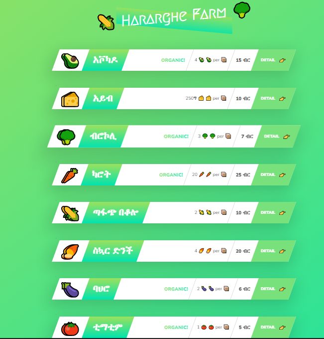

# Hararghe Farm

Hararghe Farm is a Node.js web application that provides information about different vegetables, including their nutrients, quantity, price, and description. The application parses the data from a JSON file and replaces the placeholders in an HTML template with the properties of the vegetables.

<h1 align="center">
    
</h1>


## Installation

To install and run the Hararghe Farm application, you will need to have Node.js and npm (Node Package Manager) installed on your computer. You can download and install Node.js from the official website: https://nodejs.org/

Once you have Node.js and npm installed, you can clone the repository or download the source code from GitHub:

```
git clone https://github.com/your-username/hararghe-farm.git
```

After downloading the source code, navigate to the project directory and install the dependencies using npm:

```
cd hararghe-farm
npm install
```

## Usage

To start the Hararghe Farm application, run the following command in the project directory:

```
npm start
```

This will start the server and make the application available at `http://localhost:8080/`.

When you visit the application in your web browser, you will see a list of vegetables with information about their nutrients, quantity, price, and description. The data is loaded from a `data.json` file located in the `dev-data` directory.

If you want to modify the data, you can edit the `data.json` file and restart the server to see the changes.

## Technologies Used

The Hararghe Farm application was built using the following technologies:

- Node.js: A JavaScript runtime that allows you to run JavaScript code outside of a web browser.
- HTML: The standard markup language used to create web pages.
- CSS: The style sheet language used to describe the presentation of HTML documents.

<p align="center">


</p>

## What I Learned

In the process of building the Hararghe Farm application, I learned the following concepts and technologies:

- Creating a Node.js server using the `http` module and the `createServer` method.
- Routing requests and giving responses from the server.
- Reading and writing files using the `fs` (file system) module.
- Parsing JSON data using the `JSON.parse` method.
- Building a simple API using Express.js.
- Understanding the blocking and non-blocking nature of asynchronous code in Node.js.
- Using the URL module to parse URL parameters and query strings.
- Reading npm package documentations.
- Using the slugify module to create url friendly slugs.
- Major, Minor and patch releases in version number.
- How to update and delete packages.

## Credits

The Hararghe Farm application was built as part of the "Node.js, Express, MongoDB & More: The Complete Bootcamp 2023" course on [Udemy](https://www.udemy.com/course/nodejs-express-mongodb-bootcamp/) by Jonas Schmedtmann.

## License

This project is licensed under the MIT License - see the `LICENSE` file for details.